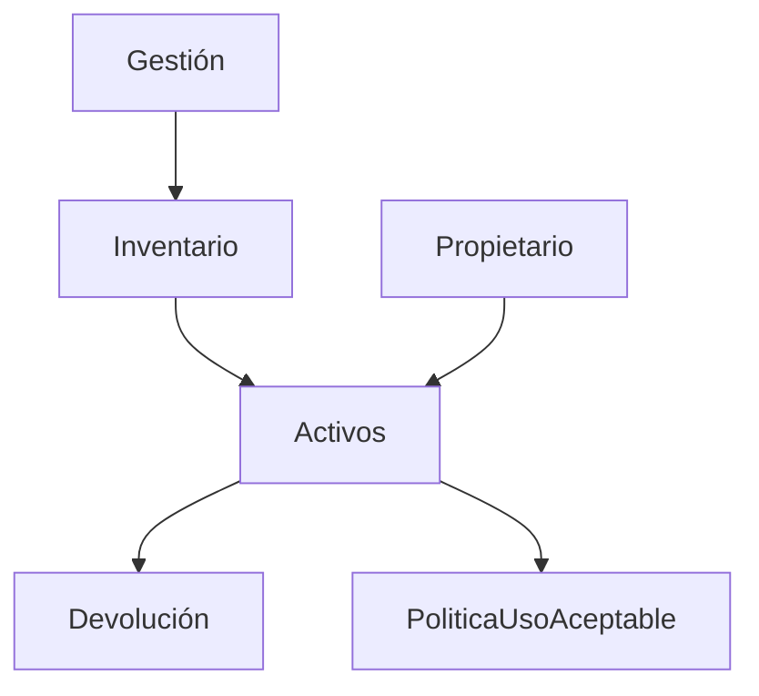

# 2. Políticas de Seguridad
2024-11-06 (YYYY-MM-DD) @ 17:08
Rodríguez López, Alejandro // UO281827

Tags:
	#showable
	Hecho en #EPI
	Sobre #PPS
	Para #Apuntes
	Otros:
	Refs:
 

## Políticas

1. La política tiene los principios y objetivos (CIA):
	- Confidenciality
	- Integrity
	- Availability
2. La política tiene asignación de responsabilidades generales y específicas.
3. La política tiene procesos para gestionar desviaciones y excepciones.
4. La política tiene un propietario (owner) pero más bien es un responsable.

Estructura de una política (máximo 2 hojas):

1. Objetivos
2. Alcance
3. Descripción
4. Responsabilidades
5. Cumplimiento o consecuencias
	1. Consecuencias evitando absolutos
6. Vigencia y actualización
7. Políticas concretas (si no están en documentos independientes)

La política debe responder:

1. Quién - tiene que hacer qué
2. Qué - busca la política
3. Dónde - alcanza la protección de la política
4. Por qué - se protege esto

Otra estructura de política (ISO27003):

1. Resumen: Visión general en una o dos oraciones.
2. Introducción: Breve explicación del tema de la política.
3. Alcance: Partes o actividades de la organización afectadas por la política.
4. Objetivos: Qué se busca con la política (CIA).
5. Principios: Qué vamos a hacer para cumplir los objetivos.
6. Responsabilidades: Quién es el responsable de las acciones para cumplir la política.
7. Resultados clave (Opcional): Resultados empresariales si se cumplen los objetivos.
8. Políticas relacionadas (Opcional): Otras políticas pertinentes para el logro de los objetivos.
9. Requisitos (Opcional): Requisitos que deben de cumplirse.

> [!info] Estructura de la política
> No hay una estructura definida para la política, cada uno la suya.
> Los contenidos sí son los mismos.
> Los contenidos de apartados opcionales aparecerían si procede en otros apartados.

## Gestión de Activos

### Clasificación de la información

- Los documentos se deben etiquetar en función de su confidencialidad:
	- Confidencial (Dirección)
	- Interno (Empresa)
	- Público (Público)

### Manipulación de soportes

- Elementos extraíbles de la empresa (USBs...)
- Qué sucede con ellos cuando terminan su propósito?
- Quién es responasable de hacer lo que haya que hacer con ellos?
