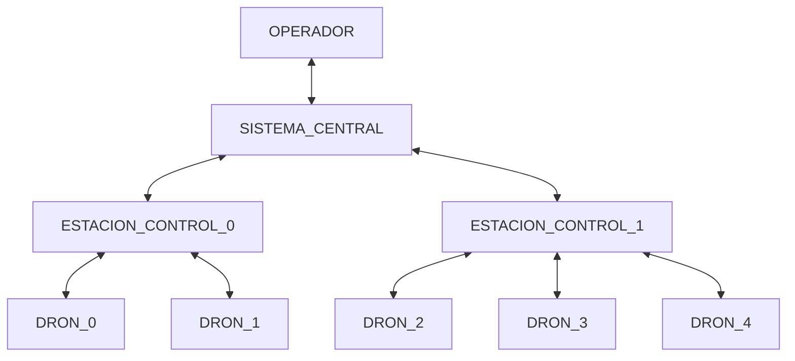

# 0. Introducción
2024-09-11 (YYYY-MM-DD) @ 17:03
Rodríguez López, Alejandro // UO281827

Tags:
	#showable
	Hecho en #EPI
	Sobre #PST
	Para #Apuntes
	Otros:
	Refs:
 

- Trabajo en grupo 80%
- Trabajo individual 20%
- Sin mínimos

Comunidad: Galicia, Asturias, Cantabria.

## Contenidos

### Servicio de Control

#### Sistema Central

Permite a los operadores:
- Gestionar
- Monitorizar
- Almacenar

#### Estaciones de Control

Son enlaces entre los distintos drones y el sistema central.

#### Dron

Los diferentes drones reciben información que envían a las estaciones de control.
Los drones despegan y aterrizan (i.e. comienzan y finalizan sus vuelos) en estaciones base.

### Ruta

El sistema debe poder registrar una ruta que cubra un área definida por un perímetro.
El sistema debe poder registrar una ruta formada por varios puntos de coordenadas.
El sistema debe poder registrar rutas que se repitan (i.e. Puntos A - B - A - B ...).

> [!question] Rutas autogeneradas?
> El sistema debe poder crear una ruta (i.e. serie de coordenadas) dado el perímetro de un área?

### Plan de vuelo

### Ejecución de plan de vuelo

### Configuración y Operación del sistema

### Adicionales

## MVP

> [!question] Cobertura de áreas a vigilar
> _Las rutas serán creadas para optimizar la cobertura del área a vigilar por los drones asignados a cada estación de control._
> Entonces un dron 'pertenece' a una estación de control?
> Entonces un área 'pertenece' a una estación de control?
> Entonces los drones de una estación de control sólo pueden sobrevolar el área que pertenece a su estación de control?

### Monitorización

- El sistema mostrará al usuario:
	- Una imagen del área a vigilar.
	- Un icono para cada dron, superpuesto en la imágen del área.
		- En su ubicación aproximada.
		- Indicando el estado (código colores, texto?)
	- Un listado de los drones en el área que muestre para cada uno:
		- Posición.
		- Velocidad.
		- Autonomía restante.
		- Estado.
		- Alarmas.

### Plan de Vuelo

- El sistema permitirá al usuario:
	- Asignar automáticamente a cada dron un plan de vuelo dada una ruta.

### Rutas

- El sistema permitirá al usuario:
	- Crear una ruta automáticamente dada un área.

### Manual

- El sistema permitirá al usuario:
	- Interrumpir el plan de vuelo de cualquier dron.
	- Asignar puntos de destino para a los que irá el dron interrumpido.
	- Continuar el plan de vuelo donde se había dejado antes de la interrupción.

### Simulador

- El sistema permitirá al usuario:
	- Iniciar la ejecución de los planes de vuelo de un conjunto de drones
		- En la realidad con drones de verdad.
		- En un simulador con drones virtuales.

> [!question] MVP
> El MVP no indica que haya que desarrollar funcionalidades para la gestión de:
> - Áreas
> - Estaciones Base
> - Estaciones de Control  
> Por lo que se entiende que estos elementos existen en la base de datos (son necesarios para otros requisitos) pero no se puede hacer CRUD sobre ellos.

> [!question] Sensores
> - Qué sensores tiene el dron en el MVP?

> [!question] Bases de Control
> En la especificación pone que hay un sistema central y varias bases de control (parecería ser que una por cada área que se estudie). Pero en el MVP no habla de monitorizar varias áreas a la vez, por lo que sólo habría una base de control, por lo que tal vez se podría omitir.

> [!question] Estaciones de Control y Rangos
> - Cuál es el tamaño mínimo de un area?
> - Cuál es el rango de accion de un conjunto de drones?

![[0. Introducción 2024-09-18 10.22.54.excalidraw|1900]]
