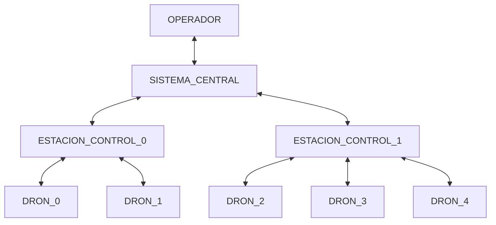

# 0. Introducción
2024-09-11 (YYYY-MM-DD) @ 17:03
Rodríguez López, Alejandro // UO281827

Tags:
	#showable
	Hecho en #EPI
	Sobre #PST
	Para #Apuntes
	Otros:
	Refs:
 

- Trabajo en grupo 80%
- Trabajo individual 20%
- Sin mínimos

Comunidad: Galicia, Asturias, Cantabria.

## Contenidos

### Servicio de Control

#### Sistema Central

Permite a los operadores:
- Gestionar
- Monitorizar
- Almacenar

#### Estaciones de Control

Son enlaces entre los distintos drones y el sistema central.

#### Dron

Los diferentes drones reciben información que envían a las estaciones de control.
Los drones despegan y aterrizan (i.e. comienzan y finalizan sus vuelos) en estaciones base.

### Ruta

El sistema debe poder registrar una ruta que cubra un área definida por un perímetro.
El sistema debe poder registrar una ruta formada por varios puntos de coordenadas.
El sistema debe poder registrar rutas que se repitan (i.e. Puntos A - B - A - B ...).

> [!question] Rutas autogeneradas?
> El sistema debe poder crear una ruta (i.e. serie de coordenadas) dado el perímetro de un área?

### Plan de vuelo

### Ejecución de plan de vuelo

### Configuración y Operación del sistema

### Adicionales

## MVP

> [!question] Cobertura de áreas a vigilar
> _Las rutas serán creadas para optimizar la cobertura del área a vigilar por los drones asignados a cada estación de control._
> Entonces un dron 'pertenece' a una estación de control?
> Entonces un área 'pertenece' a una estación de control?
> Entonces los drones de una estación de control sólo pueden sobrevolar el área que pertenece a su estación de control?

2024-09-18 (YYYY-MM-DD) @ 17:06

Hecho en #EPI

Requisitos para hacer CRUD sobre:
- Áreas
- Estaciones Base
- Estaciones de Control
O sólo dentro de la BBDD?

Se utilizan todos los sensores de los drones (i.e. humo, temperatura, meteorológico, imágenes)?
