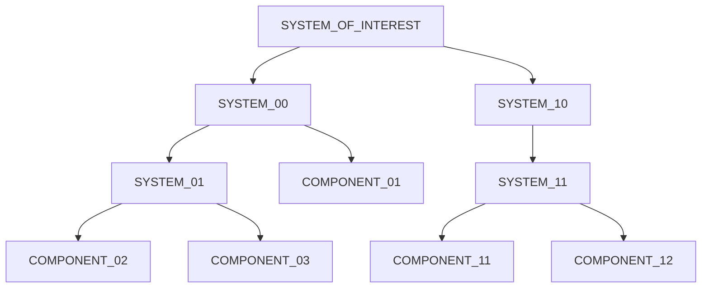

# 1. Procesos del Ciclo de Vida de Sistemas y Software
2024-09-18 (YYYY-MM-DD) @ 17:08
Rodríguez López, Alejandro // UO281827

Tags:
	#showable
	Hecho en #EPI
	Sobre #PST
	Para #Apuntes
	Otros:
	Refs:
 

Los sistemas están formados por otros sistemas más pequeños.
Los requisitos deben estar indexados utilizando ordered lists.
Debe haber un capítulo de trazabilidad que relaciones cada requisito con algún sistema de la arquitectura.

- ISO 15288: Hardware y Software.
- ISO 12207: Software.

El sistema a desarrollar se puede representar utilizando un arbol donde cada nodo es un sistema que es parte del padre y que está formado por sus hijos.

> [!info] Nodos hoja: Componentes
> Los nodos hoja (que no tienen hijos) se denominan componentes.
> No pueden ser sistemas ya que ser un sistema implicaría estar formado por otros componentes o sistemas.

## Proceso

Conjunto de actividades, compuestas por tareas, que convierten una entrada en salida.

## Tarea

Requisitos, recomendaciones o acciones orientadas a dar apoyo a la obtención de resultados.

## Stakeholders

> Estos nos los sabemos, los vamos a saltar. ~ Tuya.

## Procesos del Ciclo de Vida: 15288

### Acuerdo

### Organizativos Habilitadores del Proyecto

### Proyecto

### Técnicos
