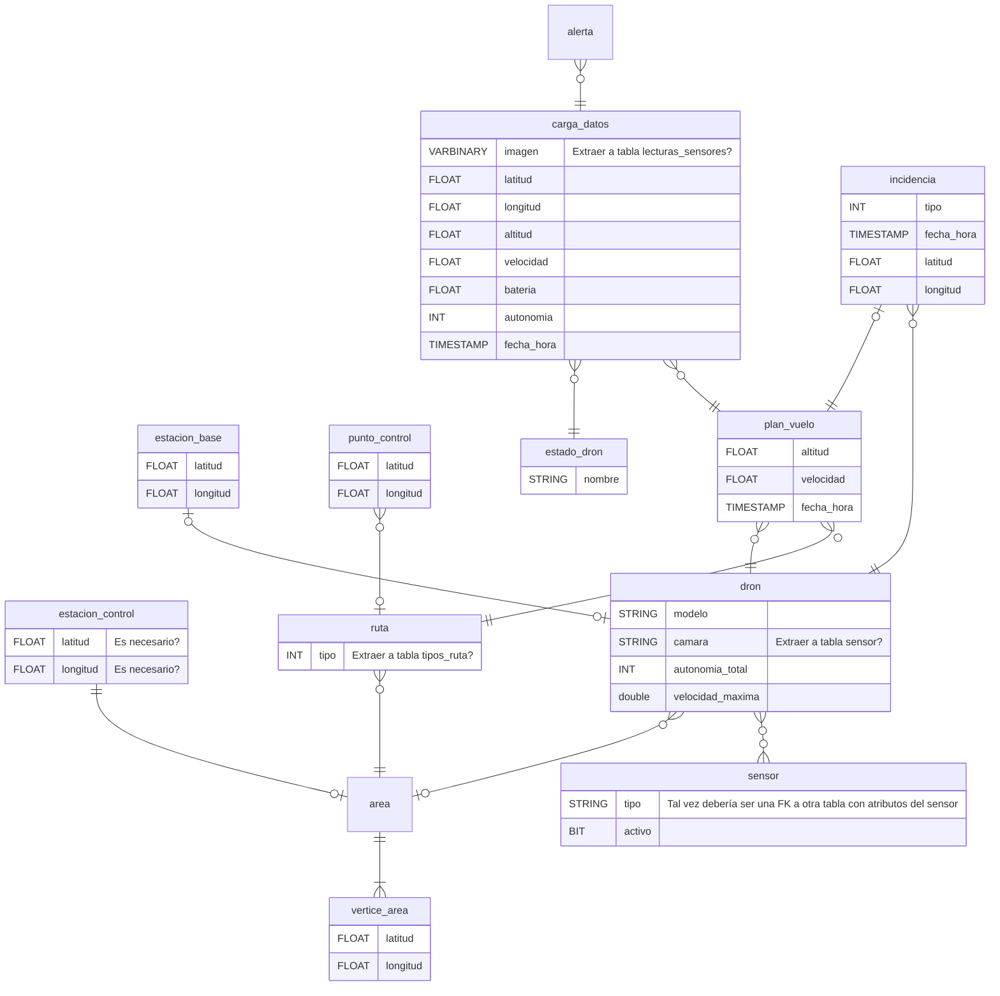

# PL-02. Revisión Requisitos
2024-09-25 (YYYY-MM-DD) @ 19:31
Rodríguez López, Alejandro // UO281827

Tags:
	#showable
	Hecho en #EPI
	Sobre #PST
	Para #Apuntes
	Otros:
	Refs:
 

1. Identificar requisitos con números.
2. Creo que no quiere requisitos hardware?.
3. ¿?
4. Añadir definiciones de rutas y áreas.
5. Añadir definición de ruta.
6. Añadir definición de área.
7. Especificar definición automática
8. Eliminar la primera frase.
	1. Especificar que no se toman mediciones en el trayecto base-inicio ni fin-base.
9. "El sistema debe permitir al usuario iniciar la ejecución de uno o varios planes de vuelo"
10. El plan de vuelo comienza cuando el usuario lo inicia.
11. Especificar que se activan automáticamente cuando se entra en la ruta.
12. "El sistema debe permitir al usuario activar y desactivas los sensores del dron en cualquier momento".
13. Añadir el resto de sensores.
14. "descrita en grados".
15. "El sistema debe permitir al usuario detener el plan de vuelo en ejecución, pasando al modo manual".
16. "El dron seguirá el plan de vuelo designado".
17. Pasando a modo manual:
	1. El dron se detiene el siguiente punto de control de su plan de vuelo.
	2. El operador podrá encolar otro punto de control.
	3. ...
18. Al cancelar, la EC indicará al dron la ubicación de la EB.
19. TODO: Se debe añadir a la bbdd algo como "ultimo punto de control pasado" para registrar planes no completados.
20. Hacer un listado de incidencias.
21. Simplemente eliminar esto...
22. Simplemente eliminar esto...
23. No sé qué es lo que no entiende...
24. Qué es el uso operativo?
25. Subespecificar:
	1. De un dron en particular.
	2. De varios drones pertenecientes a una misma área.
26. No hay a penas sistemas en el EC
27. 

2024-10-02 (YYYY-MM-DD) @ 18:21

Hecho en #EPI

## Modelo Datos - Rework

