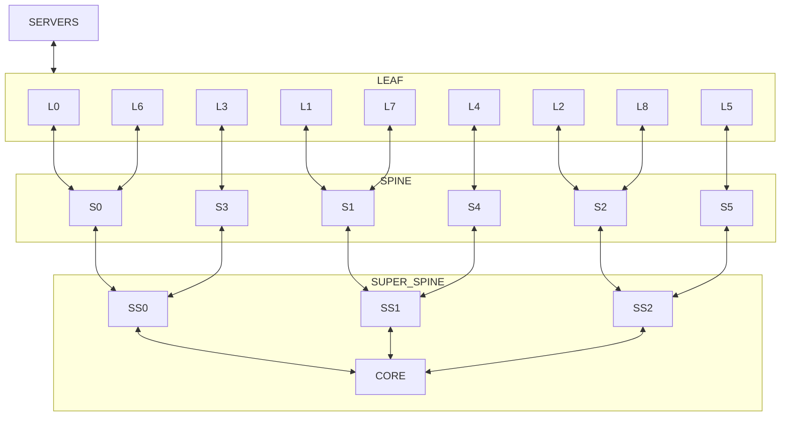

2024-09-23 (YYYY-MM-DD) @ 17:53
Rodríguez López, Alejandro // UO281827

Tags:
	#showable
	Hecho en #EPI
	Sobre #RSC
	Para #Apuntes
	Otros:
	Refs:
 

Los datacenters que siguen la arquitectura core, distribución y acceso optimizan el tráfico norte/sur, no el este/oeste.

> [!info] Tráfico norte/sur y este/oeste
> - norte/sur: Tráfico que va de los dispositivos al core y fuera de la red o viceversa.
> - este/oeste: Tráfico que va de los dispositivos a los dispositivos. 
> Las comunicaciones este/oeste se ven obligadas a viajar hasta el core porque su destinatario está en otra VLAN.

## Leaf Spine

El diseño leaf-spine optimiza ambos tipos de tráfico.
Consiste en introducir una capa spine formada por switches mágicos entre la distribución (ahora llamada leaf) y el core diseñada únicamente para mover paquetes dentro de la red entre distintas vlanes.

Frecuentemente no será posible conectar todos los dispositivos del nivel spine al core.
Se podrían conectar dispositivos del spine entre ellos para reducir el número de uplinks, pero esto incrementa la carga de algunos dispositivos por lo que no se recomienda.

Entonces se crea otra capa llamada "super spine" que se encarga de reducir el número de uplinks.

