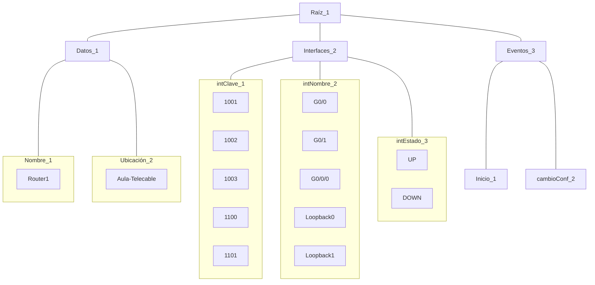
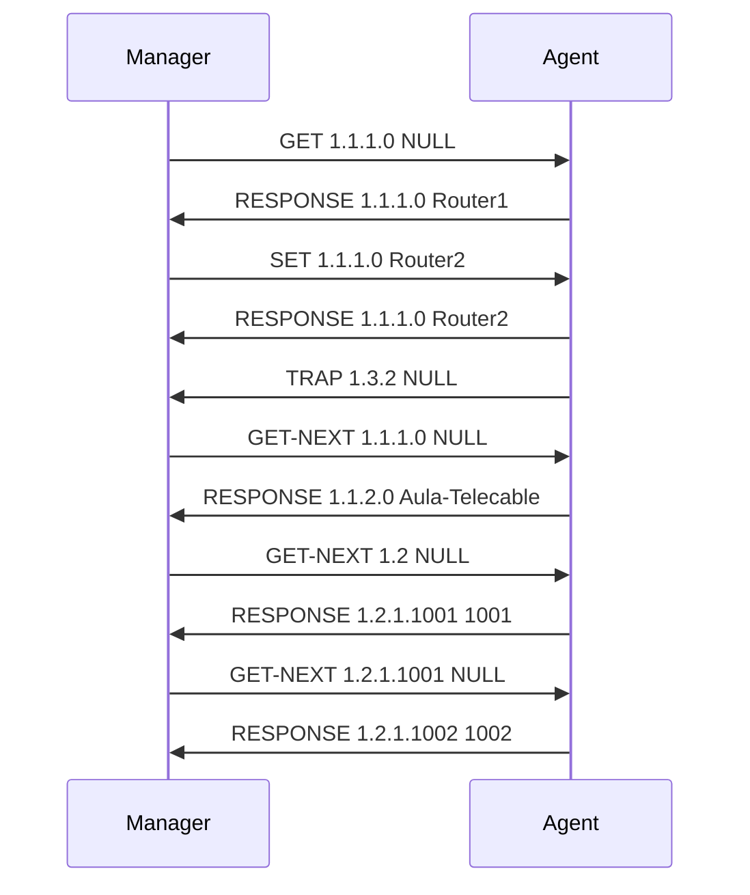

# 5. Gestión de Redes
2024-09-30 (YYYY-MM-DD) @ 17:48
Rodríguez López, Alejandro // UO281827

Tags:
	#showable
	Hecho en #EPI
	Sobre #RSC
	Para #Apuntes
	Otros:
	Refs:
 

- Agente: El software que corre en el dispositivo a gestionar.
- Gestor: El softare que permite gestionar agentes.

El gestor puede realizar peticiones al agente para que éste le responda.
El agente puede enviar al gestor eventos que hayan sucedido sin que éste los haya solicitado.
Esta es una arquitectura cliente-servidor con la cardinalidad invertida, existen más servidores (agentes) que clientes (gestores).

Existe un dispositivo intermedio que recoge conectores RJ45 de consola de otros dispositivos.
Sirve como un switch de la red de gestión.

Existe la posibilidad de utilizar la infraestructura de red existente para acceder a la configuración de dispositivos.
Si un dispositivo no tiene conexión, tampoco será posible configurarlo.

Existe la posibilidad de crear una red paralela únicamente para la gestión, de forma que aunque la red de producción se vea afectada,
la red de gestión siga activa.

## Modelo FCAPS

### F - Faults

![[5. Gestión de Redes 2024-09-30 18.30.17.excalidraw|1900]]

### C - Configuración

### A - Accounting

Medición del uso de la red.

### P - Performance

### S - Security

## SNMP - Simple Network Management Protocol

2024-10-07 (YYYY-MM-DD) @ 17:05

Hecho en #EPI

## MIB

- El MIB es una representación lógica de un dispositivo.
- Disparadores de Acciones: El dispositivo observa un dato y espera a un cambio en él, cuando sucede el cambio ejecuta una acción.
- La base de datos MIB de un dispositivo tiene forma de árbol.

- Datos Escalares: Existe sólo un valor. Ejemplo: Temperatura.
- Datos Tabulares: Pueden existir varios valores. Ejemplo: Dirección IP.
- Eventos: Los eventos no tienen valores, son funciones.

### SMI - Structure of Management Information

- SMI es el 'lenguaje' utilizado para interactuar con MIBs.
- Para nombrar elementos del árbol se pueden utilizar los nombres (o números) de los nodos desde el raíz hasta el elemento a nombrar:
	- `Raíz.Interfaces.intEstado`
	- `1.2.3`
- Para nombrar un valor de un nodo se concatena el nombre del nodo y se le concatena el ID del valor:
	- `1.2.3.1`: DOWN
	- `1.1.1.0`: Router1

> [!note] ID
> El ID de los datos escalares es siempre 0 pues sólo existe uno para cada nodo.
> El ID de los datos tabulares depende, está anotado en una columna especial que hace de PK, no tienen por qué ser números naturales en orden.

- GET: Tipo utilizado por el gestor para pedir el valor de un OID.
- SET: Tipo utilizado por el gestor para pedir el cambio de un valor de un OID.
- GET-NEXT: Tipo utilizado por el gestor para pedir el valor del siguiente objeto de un OID.
- GET-BULK: Tipo utilizado por el gestor para pedir varios valores de OIDs.
- REPONSE: Tipo utilizado por el agente como respuesta.
- TRAP/NOTIFICATION: Tipo utilizado por el agente cuando se ejecuta un evento.

> [!info] GET-NEXT
> GET-NEXT se utiliza frecuentemente en las tablas, para mostrar los valores que tiene.
> Cada GET-NEXT pasará el siguiente valor de la tabla.
