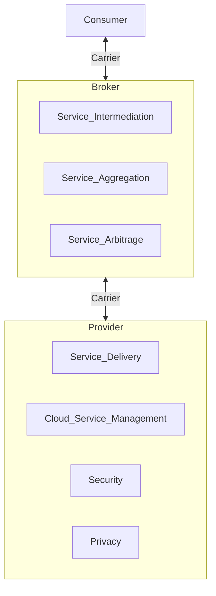

# 1. Introducción al Cloud Computing
2024-09-10 (YYYY-MM-DD) @ 16:51
Rodríguez López, Alejandro // UO281827

Tags:
	#showable
	Hecho en #EPI
	Sobre #SSO
	Para #Apuntes
	Otros:
	Refs:
 

| pg  | key            | value                                                                                                                                                                                                                                                         |
| --- | -------------- | ------------------------------------------------------------------------------------------------------------------------------------------------------------------------------------------------------------------------------------------------------------- |
| 4   | Elasticidad    | Las características computacionales son puestas a disposición y liberadas de los consumidores elásticamente, automáticamente en algunas ocasiones para adecuarse rápidamente a la demanda. El consumidor percibe unas capacidades computacionales ilimitadas. |
| 4   | Servicio       | El uso de recursos computacionales por parte de los servicios es monitorizado y controlado, la información recolectada se pone a disposición de proveedor y consumidor proporcionándose así una transparencia total en el uso de los servicios.               |
| 7   | quién usa      | Una única organización que puede englobar a múltiples consumidores (es decir, unidades de negocio).                                                                                                                                                           |
| 7   | quién gestiona | La propia organización o un tercero.                                                                                                                                                                                                                          |
| 7   | donde          | En la propia organización o en las instalaciones de un tercero.                                                                                                                                                                                               |
| 7   | quién usa      | Múltiples organizaciones que comparten intereses comunes tales como su misión, requisitos de seguridad o cumplimiento regulatorio.                                                                                                                            |
| 7   | quién gestiona | Habitualmente un tercero.                                                                                                                                                                                                                                     |
| 7   | donde          | Habitualmente en las instalaciones de un tercero.                                                                                                                                                                                                             |
| 8   | quién usa      | El público en general, ya sean empresas, personas u organizaciones.                                                                                                                                                                                           |
| 8   | quién gestiona | Un proveedor de servicios de la industria TI.                                                                                                                                                                                                                 |
| 8   | donde          | En las instalaciones del proveedor.                                                                                                                                                                                                                           |

Cloud Computing: Modelo de acceso a recursos computacionales, gestionados mediante grupos de configuraciones, compartibles a múltiples consumidores, ofrecidos bajo demanda y accesibles por la red. Tanto la asignación como liberación de los mismos debe poder realizarse con un mínimo esfuerzo por parte del proveedor.

1. Modelo de acceso a recursos.
2. Gestión mediante grupos de configuraciones.
3. Compartibles a múltiples consumidores.
4. Ofrecidos bajo demanda.
5. Accesibles por la red.
6. Asignación y liberación con un mínimo esfuerzo.

## Características Esenciales

Autoservicio bajo demanda: El consumidor puede unilateralmente adquirir capacidades de forma automatizada, sin intervención humana por parte del proveedor. 

1. Consumidor puede adquirir capacidades de forma automatizada.
2. Sin intervención humana del proveedor.

Acceso a través de la red: El consumidor puede acceder a los servicios a través de la red

1. Servicios accesibles a través de la red.

Resource Pooling: Los recursos del proveedor están agrupados para servir a múltiples consumidores. Los recursos físicos y virtuales son asignados y reasignados dinámicamente en base a la demanda de los consumidores.

1. Recursos del proveedor agrupados.
2. Recursos del proveedor sirven a múltiples consumidores.
3. Asignación y reasignación dinámica en función de demanda.

Elasticidad con rapidez:  Las características computacionales son puestas a disposición y liberadas de los consumidores elásticamente, automáticamente en algunas ocasiones para adecuarse rápidamente a la demanda. El consumidor percibe unas capacidades computacionales ilimitadas.

1. Características computacionales puestas a disposición y liberadas elásticamente.
2. Automáticamene en algunas ocasiones para adaptarse a demanda.
3. Consumidor percibe capacidades ilimitadas.

Servicio medido: El uso de recursos computacionales por parte de los servicios es monitorizado y controlado, la información recolectada se pone a disposición de proveedor y consumidor proporcionándose así una transparencia total en el uso de los servicios.

1. Uso de recursos monitorizado y controlado.
2. Información puesta a disposición de proveedor y consumidor.
3. Transparencia total en el uso de recursos.

## Modelos de Servicio

### Software as a Service (SaaS)

- Capacidad: Uso de aplicaciones software.
- Esquema: Navegador web.
- Capacidad de control: Parámetros de configuración del software.

Ejemplos: Google Workspace, Calendar, Meet, Office 365...

> [!info] SaaS
> Cloud aloja el software, el consumidor lo usa.

### Platform as a Service (PaaS)

- Capacidad: Uso de plataforma de desarrollo y ejecución. Despliegue del software sobre la plataforma de desarrollo.
- Capacidad de control: Parámetros de configuración de la plataforma. Control total sobre el software.

Ejemplos: Google App Engine, Azuer Apps Service.

> [!info] PaaS
> Cloud aloja el operativo, el consumidor desarrolla y despliega el software.

### Infraestructure as a Service (IaaS)

- Capacidad: Uso de capacidad de procesamiento.
- Capacidad de control: Sistema operativo, almacenamiento y software.

> [!info] IaaS
> Cloud aloja el hardware, el consumidor lo usa.

### Restricción común a todos los modelos

El consumidor nunca tiene acceso por debajo de la capa de virtualización en cada caso.
1. En SaaS, el consumidor no puede bajar más del software.
2. En PaaS, el consumidor no puede bajar más del operativo.
3. En IaaS, el consumidor no puede bajar más del hardware.

### Container as a Service (CaaS)

- Capacidad: Uso de contenedores para desplegar software.
- Capacidad de control: Software a desplegar y software.

> [!info] CaaS
> Cloud aloja el contenedor (con el software), el consumidor usa el software.

### Function as a Service (FaaS)

- Capacidad: Ejecución de funciones.
- Capacidad de control: Parámetros a pasar a la función.

> [!info] FaaS
> Cloud aloja el software, el consumidor lo usa.

### Desktop as a Service (DaaS)

- Capacidad: Ejecución de operativos de escritorio.
- Capacidad de control: Operativo.

> [!info] DaaS
> Cloud aloja el operativo, el consumidor lo usa.

## Modelos de Despliegue

### Nube Privada

- Quien la usa: Una única organización que puede englobar a múltiples consumidores (es decir, unidades de negocio).
- Quién la gestiona: La propia organización o un tercero.
- Dónde se ubica la infraestructura: En la propia organización o en las instalaciones de un tercero.

### Nube Comunitaria

- Quien la usa: Múltiples organizaciones que comparten intereses comunes tales como su misión, requisitos de seguridad o cumplimiento regulatorio.
- Quién la gestiona: Habitualmente un tercero.
- Dónde se ubica la infraestructura: Habitualmente en las instalaciones de un tercero.

### Nube Pública

- Quien la usa: El público en general, ya sean empresas, personas u organizaciones.
- Quién la gestiona:  Un proveedor de servicios de la industria TI.
- Dónde se ubica la infraestructura: En las instalaciones del proveedor.

### Nube Híbrida

Composición de nube privada con pública.
Permanecen como entidades independientes pero ligadas mediante tecnologías estandarizadas que posibilitan la portabilidad de datos y aplicaciones entre ellas.

## Modelo Conceptual

### Actores Principales en el Cloud Computing

- Proveedor: Provee el servicio cloud.
	- Service Delivery (Orchestration).
		- Service Layer.
			- IaaS.
			- PaaS.
			- SaaS.
			- ...
		- Resource Abstraction & Control Layer.
		- Physical Resource Layer.
			- Hardware.
			- Facility.
	- Cloud Service Management.
		- Business Support.
		- Provisioning / Configuration.
		- Portability / Interoperability.
	- Security.
	- Privacy.
- Consumidor: Consume el servicio cloud.
- Auditor: Comprueba que se cumplen las condiciones del servicio cloud.
	- Security Audit.
	- Privacy Impact Audit.
	- Performance Audit.
- Intermediario (Broker): Comunica al proveedor con el consumidor.
	- Service Intermediation.
	- Service Aggregation.
	- Service Arbitrage.
- Operador de Interconexión (Carrier): Conecta el cloud del proveedor con el consumidor.

