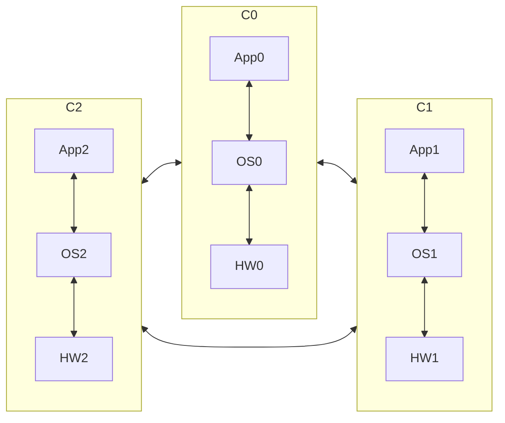
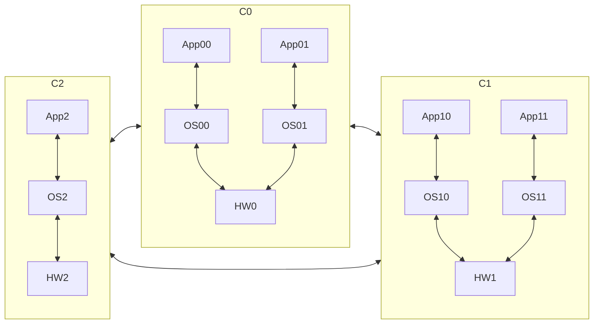
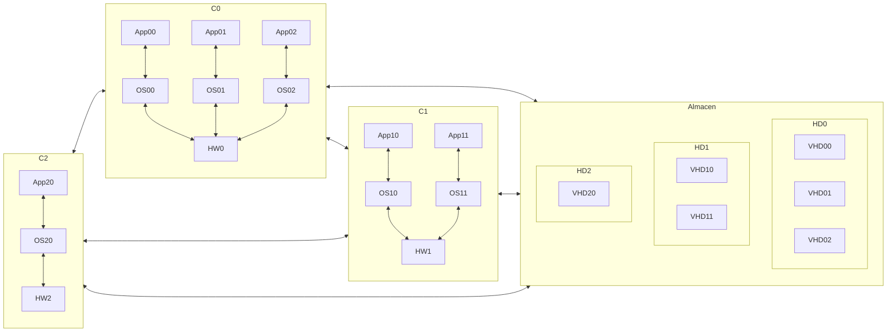
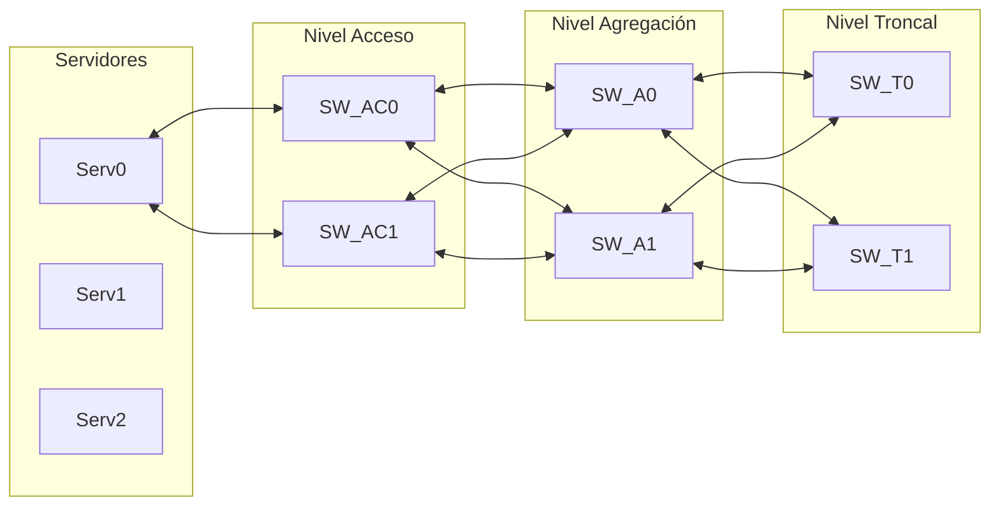

# 2. Infraestructura Virtual
2024-09-10 (YYYY-MM-DD) @ 16:51
Rodríguez López, Alejandro // UO281827

Tags:
	#showable
	Hecho en #EPI
	Sobre #SSO
	Para #Apuntes
	Otros:
	Refs:
 

| pg  | key                                    | value                                                                                                                                                                                                                                                                                                                                               |
| --- | -------------------------------------- | --------------------------------------------------------------------------------------------------------------------------------------------------------------------------------------------------------------------------------------------------------------------------------------------------------------------------------------------------- |
| 6   | Virtualización + Red de Almacenamiento | El uso de redes de almacenamiento en los entornos de virtualización permite desligar los discos virtuales usados como contenedores de máquinas virtuales de los servidores físicos en los que se ejecutarán dichas máquinas. Esto proporciona una enorme flexibilidad en la asignación de recursos físicos para la ejecución de máquinas virtuales. |
| 8   | Ventaja Esencial                       | Gran flexibilidad en la asignación de recursos hardware a las máquinas virtuales.                                                                                                                                                                                                                                                                   |
| 13  | Ventaja                                | Menos infraestructura (switches y cableado) y consecuentemente menor coste de adquisición y gestión.                                                                                                                                                                                                                                                |
| 13  | Uso                                    | En los CPD de tamaño reducido.                                                                                                                                                                                                                                                                                                                      |
| 17  | Ubicación                              | ToR (Top of Rack)                                                                                                                                                                                                                                                                                                                                   |
| 18  | Ubicación                              | EoR (End of Row)                                                                                                                                                                                                                                                                                                                                    |
| 27  | Agregación                             |                                                                                                                                                                                                                                                                                                                                                     |
| 27  | Tolerancia                             |                                                                                                                                                                                                                                                                                                                                                     |
| 28  | Requiere Configuración Switches        |                                                                                                                                                                                                                                                                                                                                                     |
| 28  | Cuántos                                |                                                                                                                                                                                                                                                                                                                                                     |
| 28  | Requirere Configuración Switch         |                                                                                                                                                                                                                                                                                                                                                     |
| 28  | Cuántos                                |                                                                                                                                                                                                                                                                                                                                                     |
| 28  | Complejidad                            |                                                                                                                                                                                                                                                                                                                                                     |
| 28  | Prestaciones                           |                                                                                                                                                                                                                                                                                                                                                     |
| 29  | Alternativas                           |                                                                                                                                                                                                                                                                                                                                                     |

## Introducción a Infraestructura Virtual

### Infraestructura sin virtualización

### Infraestructura con virtualización

### Infraestructura con virtualización y red de almacenamiento

> [!info] Virtualización + Red de Almacenamiento
> Al virtualizar las máquinas y extraer el almacenamiento del hardware, la VM se puede instanciar en cualquier servidor.

## Infraestructura hardware del CPD gestionado bajo el modelo de la infraestructura virtual

1. Servidores
2. Red de Datos
3. Red de Almacenamiento
4. Sistema de Almacenamiento

### Red de Datos

- Nivel de Acceso. Switches conectados a los servidores en ToR (Top of Rack).
- Nivel de Agregación. Switches conectados a los de ToR en EoR (End or Row).
- Nivel Trocal. Switches conectados a los EoR y el exterior.

> [!info] Redundancia
> Los servidores están conectados a dos switches de nivel de acceso.
> Igualmente, el resto de switches suelen estar redundados también.

 #### Topología Colapsada a Nivel Troncal
 
Se juntan los niveles Troncal y de Agregación.
Se reduce el hardware consecuentemente reduciendo el coste y la gestión.
Utilizado generalmente en CPDs de tamaño reducido.

#### Apilamiento de Switches (Stacking)

Existen casos donde hay más servidores que puertos en los switches de agregación.
En estos casos se hace un apilamiento de switches, donde se conectan unos switches a otros hasta que haya suficientes puertos.
Los switches de agregación tienen un límite al apilamiento.
