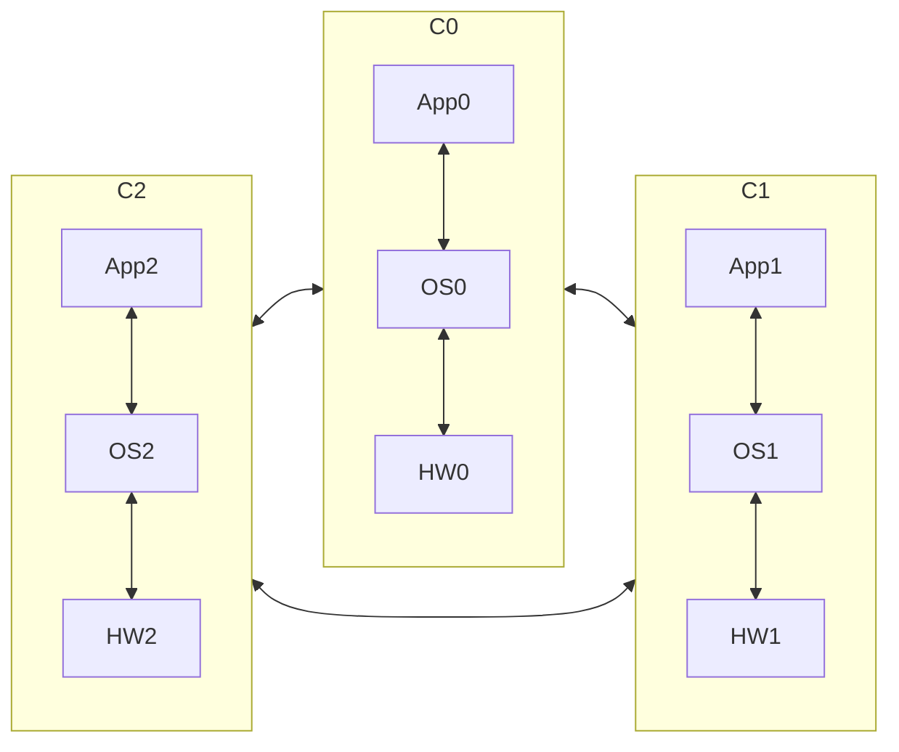
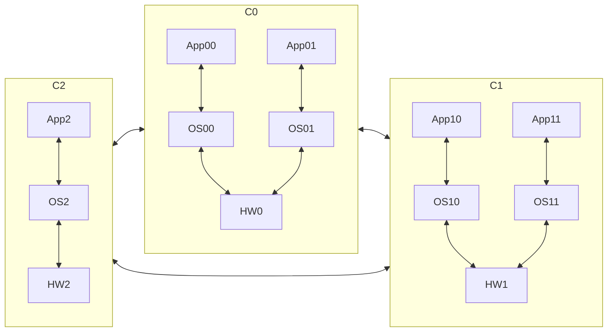
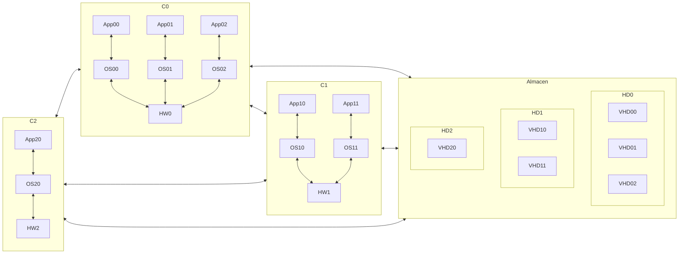
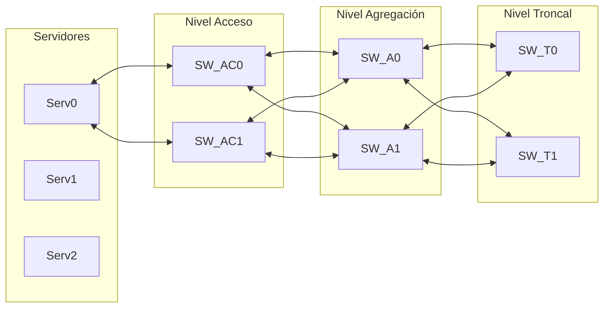
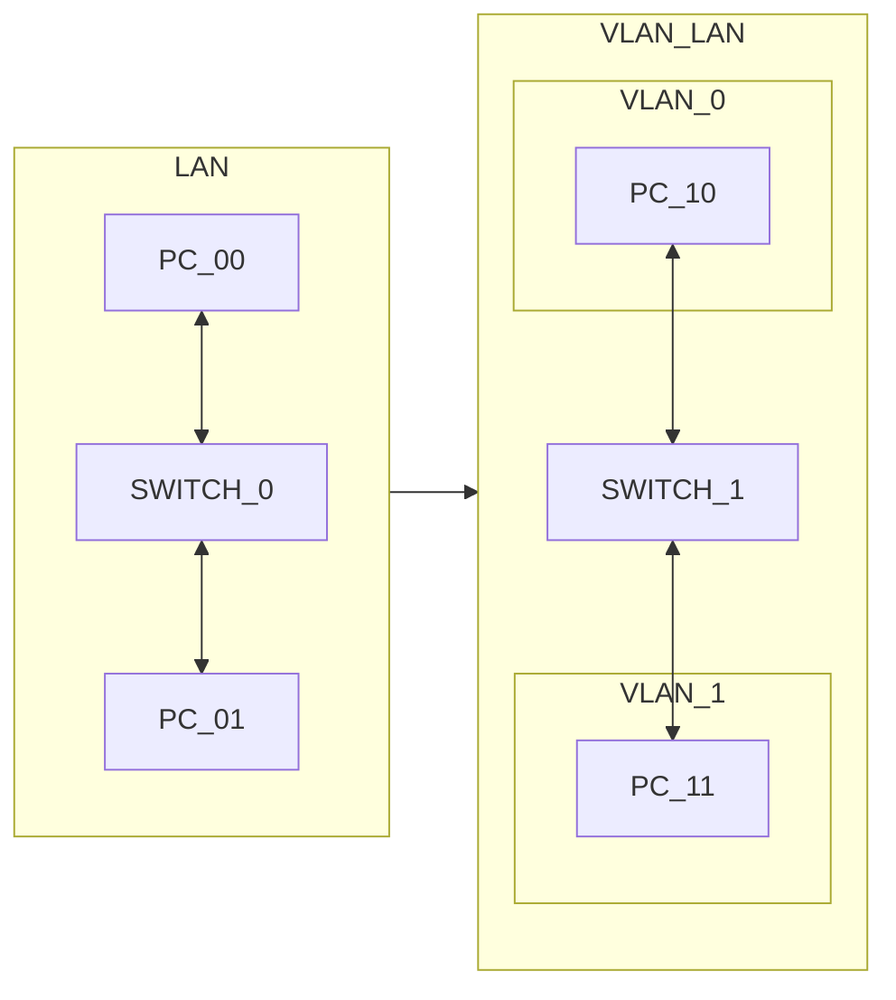
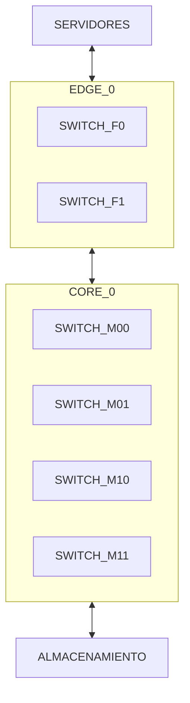
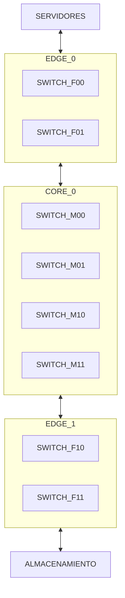
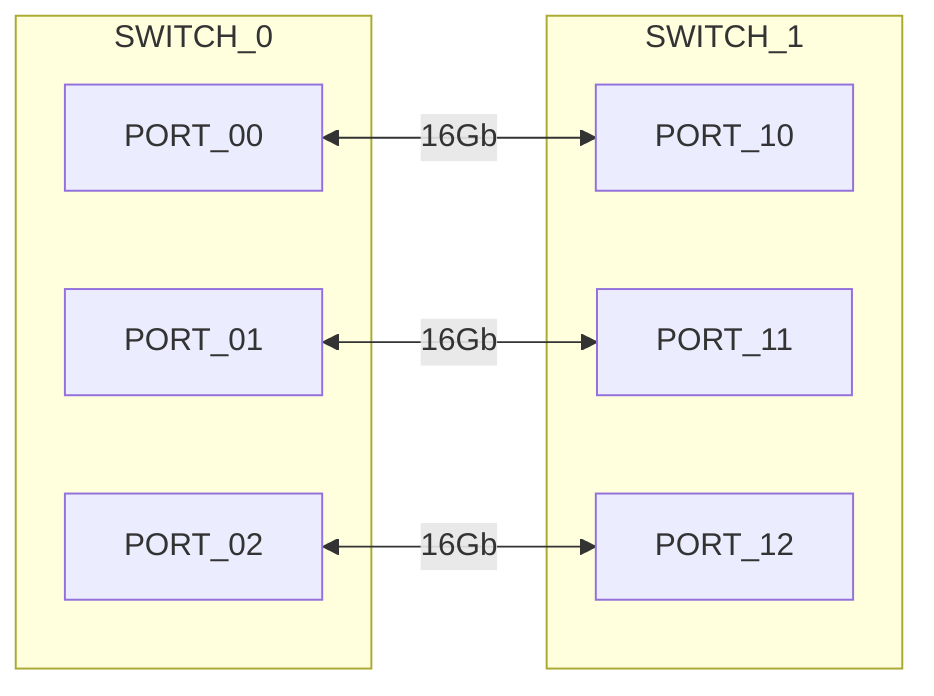
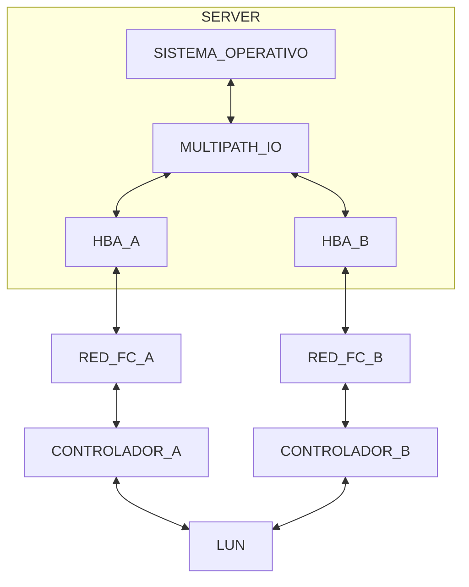
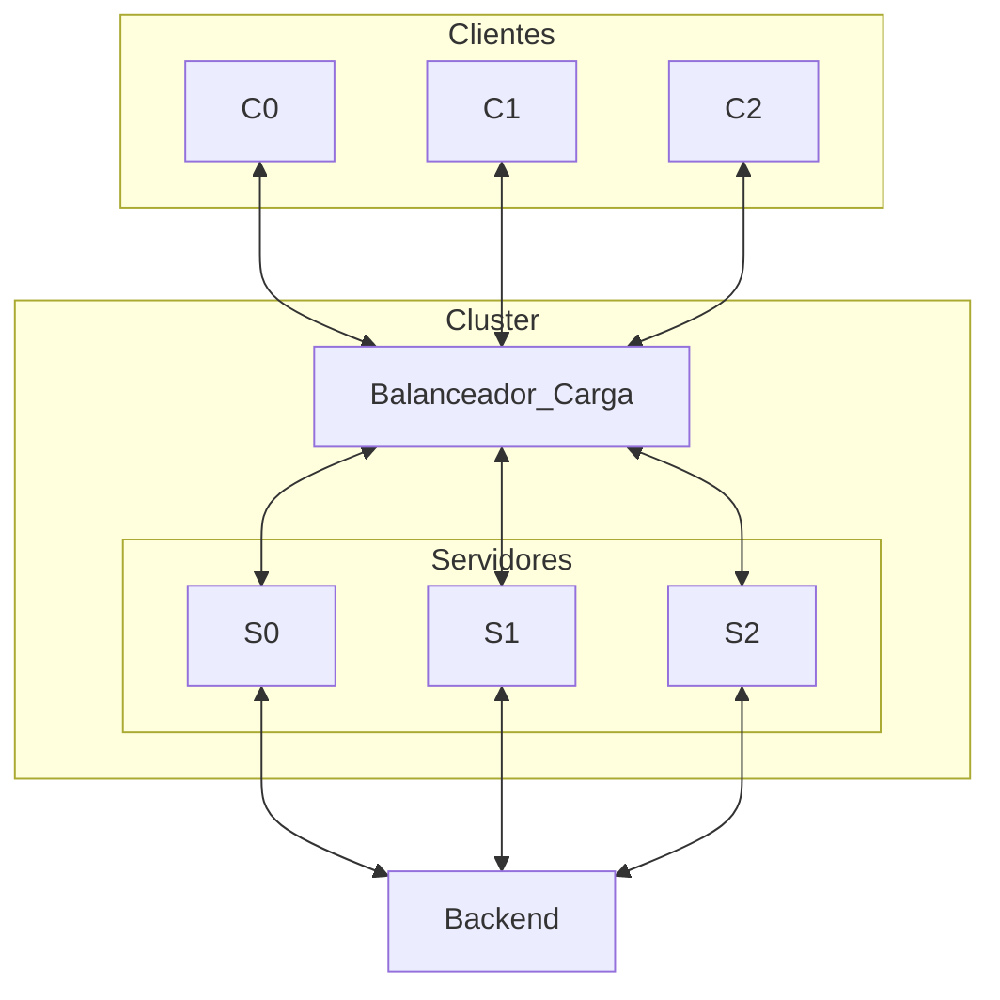

# 2. Infraestructura Virtual
2024-09-10 (YYYY-MM-DD) @ 16:51
Rodríguez López, Alejandro // UO281827

Tags:
	#showable
	Hecho en #EPI
	Sobre #SSO
	Para #Apuntes
	Otros:
	Refs:
 

| pg  | key                                    | value                                                                                                                                                                                                                                                                                                                                               |
| --- | -------------------------------------- | --------------------------------------------------------------------------------------------------------------------------------------------------------------------------------------------------------------------------------------------------------------------------------------------------------------------------------------------------- |
| 6   | Virtualización + Red de Almacenamiento | El uso de redes de almacenamiento en los entornos de virtualización permite desligar los discos virtuales usados como contenedores de máquinas virtuales de los servidores físicos en los que se ejecutarán dichas máquinas. Esto proporciona una enorme flexibilidad en la asignación de recursos físicos para la ejecución de máquinas virtuales. |
| 8   | Ventaja Esencial                       | Gran flexibilidad en la asignación de recursos hardware a las máquinas virtuales.                                                                                                                                                                                                                                                                   |
| 13  | Ventaja                                | Menos infraestructura (switches y cableado) y consecuentemente menor coste de adquisición y gestión.                                                                                                                                                                                                                                                |
| 13  | Uso                                    | En los CPD de tamaño reducido.                                                                                                                                                                                                                                                                                                                      |
| 17  | Ubicación                              | ToR (Top of Rack)                                                                                                                                                                                                                                                                                                                                   |
| 18  | Ubicación                              | EoR (End of Row)                                                                                                                                                                                                                                                                                                                                    |
| 27  | Agregación                             | El ancho de banda teórico del grupo (team) es la suma de los anchos de banda de las NIC que forman el grupo.                                                                                                                                                                                                                                        |
| 27  | Tolerancia                             | Permite que un servidor pueda ser conectado a dos caminos de red diferentes, de esta forma, si se produce un fallo en un camino, las comunicaciones pueden continuar por el camino alternativo.                                                                                                                                                     |
| 28  | Requiere Configuración Switches        | No.                                                                                                                                                                                                                                                                                                                                                 |
| 28  | Cuántos                                | A uno o más de uno.                                                                                                                                                                                                                                                                                                                                 |
| 28  | Requirere Configuración Switch         | Sí.                                                                                                                                                                                                                                                                                                                                                 |
| 28  | Cuántos                                | A uno sólo.                                                                                                                                                                                                                                                                                                                                         |
| 28  | Complejidad                            | La alternativa independiente del switch es mucho más simple ya que no requiere realizar configuraciones en los switches.                                                                                                                                                                                                                            |
| 28  | Prestaciones                           | La alternatvia independiente del switch presenta el problema de que el tráfico entrante sólo puede ser manejado por una de las NIC del grupo. Esto limita las prestaciones de este tipo de tráfico.                                                                                                                                                 |
| 29  | Alternativas                           | Sólo es posible utilizar el teaming independiente del switch ya que el grupo debe conectarse a switches diferentes.                                                                                                                                                                                                                                 |
| 33  | Coste de instalación                   | Menor en el caso de la topología Edge-Core debido a la utilización de un menor número de switches así como cables y transceptores.                                                                                                                                                                                                                  |
| 33  | Prestaciones                           | Ligeramente superior en el caso de la topología Edge-Core debido a que las comunicaciones deben atravesar un menor número de switches.                                                                                                                                                                                                              |
| 33  | Escalabilidad                          | Muy inferior en el caso de la topología Edge-Core debido a la falta del nivel Edge para los sistemas de almacenamiento, lo que limita muy significativamente la escalabilidad de esta parte de la instalación.                                                                                                                                      |
| 34  | Requisito                              | La redundancia, que es indispensable para la existencia de caminos de comunicación alternativos.                                                                                                                                                                                                                                                    |
| 34  | Donde                                  | En el sistema operativo de los switches.                                                                                                                                                                                                                                                                                                            |
| 34  | FSPF                                   | Es un protocolo de enrutamiento usado en redes FiberChannel que calcula el mejor camino posible entre switches y determina rutas alternativas en caso de fallos.                                                                                                                                                                                    |
| 38  | Uso                                    | Nivel Edge.                                                                                                                                                                                                                                                                                                                                         |
| 39  | Uso                                    | Nivel Core.                                                                                                                                                                                                                                                                                                                                         |
| 44  | Factor de forma                        | Rack o Blade.                                                                                                                                                                                                                                                                                                                                       |
| 44  | HBA                                    | Para la correcta conexión a una red tolerante a fallos.                                                                                                                                                                                                                                                                                             |
| 44  | NIC                                    | Para la creación de un grupo (team) con objeto de proporcionar tolerancia a fallos.                                                                                                                                                                                                                                                                 |
| 46  | Solución                               | Garantizarla mediante soluciones software por ejemplo mediante replicación de servicios.                                                                                                                                                                                                                                                            |
| 60  | Definición                             | Es un conjunto de computadores interconectados que trabajan colaborativamente y que se presentan a los usuarios y a otros sistemas y aplicaciones como si fueran un sistema único.                                                                                                                                                                  |
| 60  | Objetivo                               | Mejorar las prestaciones o la disponibilidad o ambas características respecto a las proporcionadas por un computador único.                                                                                                                                                                                                                         |
| 66  | Definición                             | Es la conmutación automática del control de los servicios o aplicaciones activas en un nodo de un clúster hacia el otro nodo cuando se produce un fallo en el nodo inicialmente activo.                                                                                                                                                             |
| 69  | SAN                                    | Cada servidor contará al menos con dos HBAs para conectarse a los caminos redundantes de la SAN.                                                                                                                                                                                                                                                    |
| 69  | Redundancia Caminos                    | Cada servidor contará con un módulo multipath IO (MPIO) para la gestión de caminos redundantes.                                                                                                                                                                                                                                                     |
| 74  | Consecuencias                          | Corrupción de la información en el almacenamiento compartido del clúster, por consiguiente el clúster dejaría de operar correctamente.                                                                                                                                                                                                              |
| 74  | Concepto                               | Número mínimo de elementos del clúster operativos y visibles entre ellos para formar clúster. Este número debe ser igual a la mitad de elementos del clúster más uno.                                                                                                                                                                               |
| 78  | Balanceo                               | Las MV pueden o bien arracarse o bien moverse hacia unos nodos u otros según su estado de carga.                                                                                                                                                                                                                                                    |
| 78  | Mejoras Operativas                     | El libre movimiento de MVs facilita las labores de actualización y mantenimiento. Ejemplo: Liberación de la carga de un servidor para su puesta en mantenimiento.                                                                                                                                                                                   |
| 88  | Ubicación                              | Local al disco (en el mismo sistema en el que se ubica el disco).                                                                                                                                                                                                                                                                                   |
| 89  | Ubicación                              | Remota respecto al disco (en un sistema diferente al del disco).                                                                                                                                                                                                                                                                                    |
| 91  | Situación                              | Los servidores acceden a la misma LUN, el stack de software para la gestión del disco de cada servidor no es consciente de que el stack de software para la gestión del disco del otro servidor accede a la misma LUN. Esto terminará generando situaciones de inconsistencia o corrupción de la información almacenada en la LUN.                  |

## Introducción a Infraestructura Virtual

### Infraestructura sin virtualización

### Infraestructura con virtualización

### Infraestructura con virtualización y red de almacenamiento

> [!info] Virtualización + Red de Almacenamiento
> Al virtualizar las máquinas y extraer el almacenamiento del hardware, la VM se puede instanciar en cualquier servidor.

## Infraestructura hardware del CPD gestionado bajo el modelo de la infraestructura virtual

1. Servidores
2. Red de Datos
3. Red de Almacenamiento
4. Sistema de Almacenamiento

### Red de Datos

- Nivel de Acceso. Switches conectados a los servidores en ToR (Top of Rack).
- Nivel de Agregación. Switches conectados a los de ToR en EoR (End or Row).
- Nivel Trocal. Switches conectados a los EoR y el exterior.

> [!info] Redundancia
> Los servidores están conectados a dos switches de nivel de acceso.
> Igualmente, el resto de switches suelen estar redundados también.

 #### Topología Colapsada a Nivel Troncal
 
Se juntan los niveles Troncal y de Agregación.
Se reduce el hardware consecuentemente reduciendo el coste y la gestión.
Utilizado generalmente en CPDs de tamaño reducido.

#### Apilamiento de Switches (Stacking)

Existen casos donde hay más servidores que puertos en los switches de agregación.
En estos casos se hace un apilamiento de switches, donde se conectan unos switches a otros hasta que haya suficientes puertos.
Los switches de agregación tienen un límite al apilamiento.

2024-09-17 (YYYY-MM-DD) @ 17:03

Hecho en #EPI

#### VLAN

- Tecnología permite segmentación del dominio broadcast de una LAN en múltiples dominios broadcast independientes.

- Etiquetado: Campo de 4 bytes en las cabeceras de los paquetes ETH. La VLAN se indica con 12bits de este campo.

> [!info] Etiqueta VLAN: Switchport y Trunk
> Un paquete que entra por un switchport es de una VLAN conocida porque un switchport sólo puede ser de una VLAN.
> Un paquete que entra por un trunk es de una VLAN desconocida porque un trunk puede pertenecer a varias VLAN.
> La etiqueta se utiliza cuando el paquete viaja por un trunk para que el switch destino sepa la VLAN a la que pertenece.
> La etiqueta se pone y se quita al entrar y salir de un enlace trunk respectivamente.

En una plataforma de virtualización (particularmente las de paradigma de infraestructura virtual) es interesante el uso de VLANs para segregar el tráfico de infraestructura del de los clientes.
Incluso sería posible hacer distintas VLANs para distintos clientes, de forma que cada uno tenga su VLAN.

> [!info] VLAN virtual
> Si tratamos que cada cliente tenga su propia VLAN, un mismo servidor (que tiene varias VM de varios clientes) utilizará un trunk para comunicarse con su switch de acceso.
> El servidor tendrá un NIC físico cuyo puerto ETH funcionará en modo trunk.
> Cada VM del servidor tendrá un NIC virtual cuyo puerto ETH funcionará en modo switchport de la VLAN que le corresponda a la VM.
> Entonces todo el tráfico está etiquetado porque todas la conexiones son trunk salvo al llegar a las NIC virtuales.

#### NIC Teaming

Un grupo de NICs (generalmente dos) que se comportan como una NIC.
T27, Concepto: ... (El servidor ve al team como una sola NIC).

##### Ancho de Banda

La alternatvia independiente del switch presenta el problema de que el tráfico entrante sólo puede ser manejado por una de las NIC del grupo. Esto limita las prestaciones de este tipo de tráfico.

![[2. Infraestructura Virtual 2024-09-17 17.58.50.excalidraw|1900]]

Los dos NIC comparten IP pero no MAC.
La tabla MAC de un switch sólo puede tener uno de los dos registrados.
Entonces, la descarga de datos (i.e. tráfico del switch al PC) sólo utilizará una NIC.
Mientras, la subida de datos (i.e. tráfico del PC al switch) utilizará ambas NIC.

##### Tolerancia a Fallos

Uno de los NIC se encuentra activo y el otro como pasivo.
Si el activo se interrumpe, el pasivo pasa a ser el activo.
Ambos NIC utilizan la misma dirección MAC.

> [!info] NIC Teaming: MACs
> En todos los casos, ambos NIC usan la misma dirección IP.
> Si el team busca agregar ancho de banda, cada NIC utiliza una MAC distinta.
> Si el team busca incrementar la tolerancia a fallos, ambos NIC utilizan la misma MAC.

Las tablas MAC de los switches sólo tienen una salida para una MAC ya que el otro NIC no está activo.
Si ambos NIC estuviesen activos, podría habler problemas con las tablas MAC de los switches.

### Red de Almacenamiento

#### Topología Edge-Core

- Nivel EDGE: Conjunto de switches que conectan a los servidores con el nivel core.
	- Conexiones FiberChannel con tarjetas HBA de los servidores.
	- ToR.
	- Switches de configuración fija.
- Nivel CORE: Conjunto de switches que conectan a los switches de nivel edge con el sistema de almacenamiento.
	- Switches modulares.
	- Redundados.

#### Topología Edge-Core-Edge

#### Redundancia y Resiliencia

Redundancia: Existencia de componentes repetidos con objeto de eliminar puntos de fallo únicos.
Resiliency: Capacidad de recuperación. Capacidad de la red de establecer un camino alternativo al camino activo.

Para incrementar la resiliencia se utiliza el protocolo FSPF, que calcula rutas alternativas en redes de switches.

#### Trunking (FiberChannel)

Consiste en utilizar varias conexiones FC entre switches para:
- Agregación de ancho de banda.
- Tolerancia a fallos.

#### Multipath IO

Módulo software que comunica al servidor con la LUN.
Permite al servidor utilizar dos tarjetas HBA, en dos redes FC distintas que terminen en la misma LUN.
Permite funcionar en dos modos:
- Tolerancia a fallos.
- Balanceo de carga.

2024-09-24 (YYYY-MM-DD) @ 18:36

Hecho en #EPI

#### Servidores

- Elevada disponibilidad.
- Soporta virtualización.
- Capacidad de cómputo razonablemente elevada.

Los servidores tienen varios factores de forma:
- Torre.
- Rack.
- Blade.
En los CPDs se tiende a utilizar Rack o Blade.

##### Requisitos

- Optimización del ratio cómputo/coste.
- Reducción de la eficiencia energética.
- Maximización de la escalabilidad.
- Maximización de la simplicidad de gestión y mantenimiento.
- Maximización de la sostenibilidad.

## Características de Infraestructura Global

El principal objetivo deja de ser la disponibilidad y pasa a ser la optimización del cómputo frente al coste.

- No se replican componentes.
- Se comparten componentes (como las PSU) entre varios servidores.
- Se replican las aplicaciones a nivel de software (virtualización) para amenizar la reducción de disponibilidad.

## Clúster

### Balanceo de Carga

