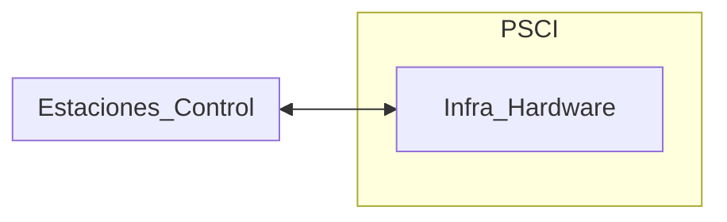
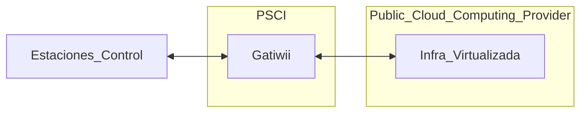
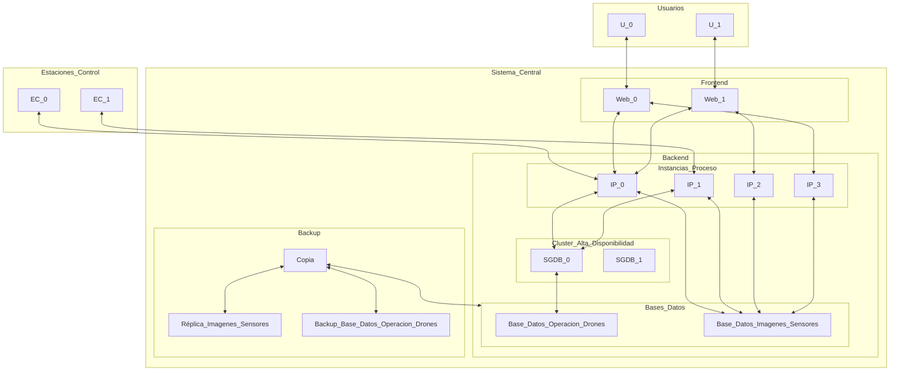

# Trabajo en Grupo
2024-09-24 (YYYY-MM-DD) @ 17:12
Rodríguez López, Alejandro // UO281827

Tags:
	#showable
	Hecho en #EPI
	Sobre #SSO
	Para #Apuntes
	Otros:
	Refs:
 

## Implementación 

> [!info] PSCI
> El Proveedor de Servicios de Control de Incendios

### Alternativa 1

### Alternativa 2

## Consideraciones Operativas

- Período alto de riesgo de incendio: Junio, Julio, Agosto y Septiembre.
- Período bajo de riesgo de incendio: El resto de meses.

- Cuando un dron está operativo, lo está durante 12 horas del día.
- En el período alto, el 100% de los drones está operativo.
- En el período bajo, el 20% de los drones está operativo.

> [!warning] Número de drones
> El número de drones se estima en otra asignatura, debería estar algo por encima de los 1000 drones.

## Dimensionamiento

El sistema debe soportar el número de drones requerido para la zona seleccionada.
El sistema de almacenamiento debe ser suficiente para almacenar como mínimo los datos generados en tres años.

## Arquitectura Lógica del Sistema Central

- La Base_Datos es un almacén de datos.
- Los SGDB son motores (como psql) que manejan el almacén.
- Hay otro almacén no representado en el diagrama que se encarga de guardar las imágenes de todas las instancias virtuales.
- La réplica de la base de datos de imagenes y sensores es una réplica tal cual.
- El backup de la base de datos de operaciones de drones es incremental.

## Requisitos

### Cómputo

| Tipo de Instancia | Núcleos         | Memoria         | Disco |
| ----------------- | --------------- | --------------- | ----- |
| Proceso           | 2               | 8               | 0     |
| SGDB              | Según nº drones | Según nº drones | 0     |
| Web               | 2               | 8               | 0     |
| Copia             | 2               | 16              | 0     |

### Almacenes

#### Datos de Operaciones de Drones

- 25GB.

#### Imágenes y Datos de Sensores

- Se estima que un dron genera 6MB/min.
- De toda la información recibida, se almacena de forma permanente sólo un 10% con el objetivo de reducir el tamaño del almacenamiento.

#### Máquinas Virtuales

- 10GB para cada máquina.

#### Backup

- El tamaño del backup es despreciable en comparación al de la réplica.
- El tamaño de todo el backup es el de la réplica (i.e. tan grande como el de imágenes y datos de sensores).

#### Prestaciones del Almacenamiento

- Almacenamiento de máquinas virtuales: SSD.
- Almacenamiento de imágenes, sensores, operaciones, backup y réplica: HDD.

Cabina Almacenamiento: Serie Power Vault ME4.

> [!warning] Número de servidores
> En lugar de seleccionar un servidor con muchas capacidades, seleccionar varios servidores de menor capacidad.
> Esto hace que si se cae uno de los servidores no se pierda todo el servicio.
> Debería resultar en un número de servidores entre 6 y 15.
