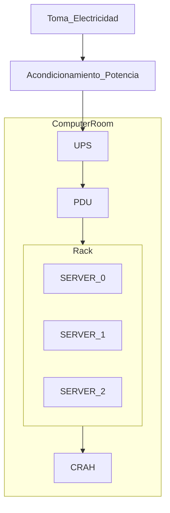
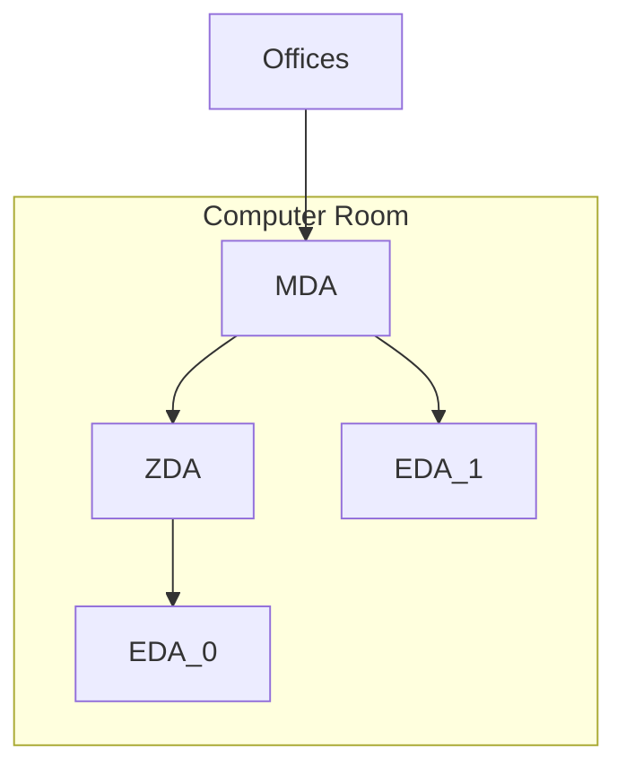
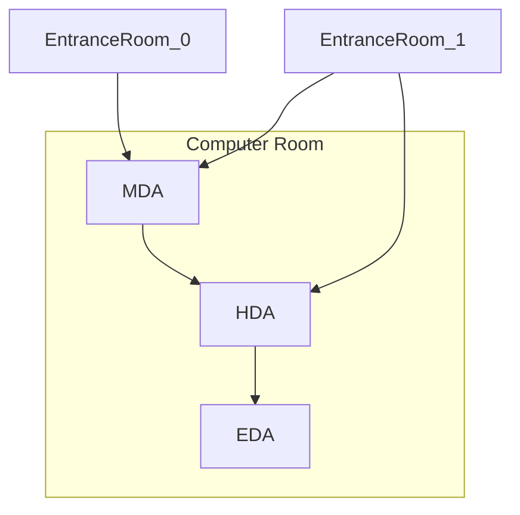

# 1. Centros de Servicio
2025-01-20 (YYYY-MM-DD) @ 17:08
Rodríguez López, Alejandro // UO281827

Tags:
	#showable
	Hecho en #EPI
	Sobre #CSS
	Para #Apuntes
	Otros:
	Refs:
 

- Grupo de servidores que prestan servicio:
	- Dentro de mi empresa. Generalmente empresas que ya son de TI.
	- Fuera de mi empresa (outsourcing). Generalmente empresas que no son de TI.

- Ejemplos de Datacenters
	- CAU: Centro de Atención a Usuarios.
		- Service Desk
		- Gestión de Incidencias
		- Si el usuario tiene problemas, se encarga el CAU de resolver.
	- NOC: Networks Operation Center.
		- Atención al servidor.
		- Si el server no tiene conexión, se encarga el NOC de resolver.
	- SOC: Security Operations Center.
		- Controla quién accede a dónde.
		- Observa accesos extraños.
		- Gestiona accesos.

- Housing: Yo meto mis servidores en su CPD.
- Hosting: Yo meto mi software en sus servidores de su CPD.

## CPD

### Componentes

- Servidores
- Comunicación
- Anti-incendios
- Refrigeración
- Alimentación

- Servicios TI:
	- Almacenamiento.
	- Computación.

- Infraestructura física
	- Cableado
	- Potencia Eléctrica
	- Racks
	- Anti-incendios

- UPS: SAI
- PDU: Power Distribution Unit
- CRAH: Computer Room Air Handler

### Estándares

- AHRAE: American Safety of Heating, Refrigerating and Air Conditioning Engineers.
	- Define las temperaturas a las que pueden estar personas.
	- Define otras cosas sobre temperatura.
	- Entonces, no sobre CPDs pero la temperatura está relacionada.

- TIA
	- Sobre cableados.
	- Sobre estructura.

- BICSI: Data Center Design and Implementation Best Practices
	- Complementa al TIA.
	- Es lo mismo que el TIA pero deja más padding.

- EN 50600: Data Center Facilities and Infraestructures
	- Basdado en Análisis de Riesgos.

- Uptime Institute Data Center Site Infrastructure Tier Standard
	- Documentos de Diseño
	- No deja claro qué piden y qué no.
	- Son la empresa certificadora de su rating.
	- Por lo tanto, no les interesa que sepas llegar a los objetivos.

## Certificaciones

- Operational
- Constructed
- Design

Siempre se asigna la menor de las partes del CPD:
Si tengo un CPD con 3 partes y certificaciones design: IV, IV y III.
El CPD tiene certificación Design III.

## TIA-942

### Espacio y Disposición

- Entrance Room (ER): Equipos de Distribuidores. (Fuera del CPD)
	- Alimentación.
	- Comunicaciones.
- Main Distribution Area (MDA): Core de distribución de red.
	- Switches.
	- Routers.
	- PBX (centralitas de teléfono).
- Horizontal Distribution Area:
	- KVM (Keyboard, Video and Mouse), permite conectar a varios servidores con un mismo terminal.
	- LAN.
	- SAN.
- Zone Distribution Area (ZDA).
	- Area intermedia que se utiliza si la EDA está muy lejos de su HDA.
- Equipment Distribution Area:
	- Racks.
	- Cabinas.
	- Equipos de red finales.

> [!note] PBX y M13.
> Estos equipos son de distribuidores, pero no se pueden poner en la ER.
> Esto se debe a la longitud máxima del cable.
> Clock Skew.

- Cableado Backbone (vertical).
- Cableado Horizontal (para equipos finales).

#### Topología Reducida

- La MDA tiene los equipos de MDA y HDAs.

#### Topología Distribuida

> [!warning] Entrance Room Secundaria
> Sólo desde una ER secundaria se permite conextión a las HDAs (a una, varias o todas).
> Nunca desde la ER principal.

#### Requisitos

- Evitar limitar la escalabilidad del CPD.
- Ver las traspas... Es un huevo de cosas.

#### Pasillo Frío y Pasillo Caliente

- En el pasillo frio están los frontales de los armarios (de donde recogen aire).
- En el pasillo caliente están los traseros de los armarios (de donde expulsan aire).
- Sólo nos preocupamos de enfriar uno de cada dos pasillos.
- Cableado de datos por el pasillo caliente.
- Cableado de alimentación por el pasillo frío.
- Siempre debería quedar un número impar de pasillos.

### Infraestructura del Cableado

- Cable Horizontal:
	- De MDA o HDA a EDA.
	- Topología en estrella.

#### Vías del cableado

- Separación del cableado de datos del almacenamiento.
- Cableado inferior y superior (por debajo del suelo técnico y por el techo).
- Potencia, cobre, fibra (de arriba a abajo).

#### Fiabilidad o Ratings

- Se basa en obtener redundancia y eliminar puntos de fallos.
- 2(N+1), el doble más uno, la fórmula está mal pero se escribe así, amén.

### Niveles

- 1, básico.
	- Sin redundancia.
	- Necesario apagar para mantenimiento.
	- Disponibilidad baja.
- 2, componentes redundantes.
	- Redundancia en algún componente.
	- Necesario apagar para algún mantenimiento.
	- Tiene generador.
	- Disponibilidad baja.
- 3, mantenimiento simultáneo.
	- No es necesario apagar para mantenimiento planificado.
	- Múltiples caminos de distribución de potencia eléctrica y refrigeración, N+1.
	- Disponibilidad alta.
- 4, tolerante a fallos.
	- Soporta un evento de peor caso no planificado sin caerse.
	- Múltiples caminos de distribución de potencia eléctrica y refriegeración, 2(N+1).
	- Disponibilidad muy alta.