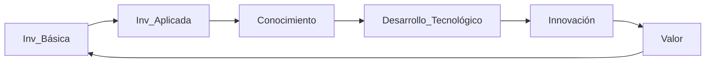

# 1. Fundamentos de I+D+i
2025-03-17 (YYYY-MM-DD) @ 17:12
Rodríguez López, Alejandro // UO281827

Tags:
	#showable
	Hecho en #EPI
	Sobre #IDI
	Para #Apuntes
	Otros:
	Refs:
 

## Conceptos Básicos

- Lejos del mercado (lo importante es la intención, intención no implica producto):
	- Investigación Básica: I+D no vinculado a un producto (no hay intención) (Ej: Investigo un algo)
	- Investigación Aplicada: I+D vinculado a un producto (sí hay intención) (Ej: Investigo algoritmos que resulten en el algo)
- Cerca del mercado (aquí implica que haya un producto o maqueta, producto no implica valor):
	- Desarrollo Tecnológico: Aplica resultados de investigación (cualquiera) para producir algo (Ej: Prototipo que utiliza el algoritmo)
- En el mercado (aquí sí tiene que haber algo que genere valor):
	- Innovación: Actividad que genera valor (Ej: Implementación del prototipo en una fábrica)

## Círculo de Innovación

No se requiere viajar por todo el círculo.
Se puede partir de una Investigación Básica existente y desarrollar a partir de ella.

## Por qué Innovación?

1. Mercado: Hay cambios en el mercado (ver traspa)
2. Moda o necesidad:
	1. Defensivo: Competidores agresivos entonces innovo.
	2. Reactivo: Quiero aumentar mi cuota de mercado entonces innovo.
3. Otra cosa que no vi

Innovación:
- Cambio (no solo tecnológico)
- basado en conocimiento (no solo cientifico)
- que genera valor (no solo económico).

## Naturaleza Innovación - Ejemplos

- Tecnológica: Nuevos algoritmos
- Comercial: Nuevas ofertas
- Organizativa: Subcontratación

## Innovación como Estrategia

1. Estrategia Empresarial: La empresa marca el objetivo principal.
2. Objetivos de I+D+i: En función de los objetivos de la empresa.
3. Presupuesto I+D+i: La empresa asigna un presupuesto en función de los objetivos.
4. DAFO: Se junta con el presupuesto y objetivos para formar una estrategia.
5. Asignación de recursos: En función de la estrategia.
6. ...

## Implementación

Ciclo de Deming con nombre distinto:

1. Vigilar: Buscar señales para innovar.
	- Vigilancia Tecnológica: Captar información interior y exterior.
	- Prospectiva Tecnológica: Descubrir hacia dónde va la tecnología, ciencia y sociedad.
	- Análisis de Mercado.
	- Otra más...
2. Focalizar: 
	1. Creatividad: Generar ideas que tengan valor a través de la conexión de otras ideas.
	2. Auditorías Tecnológicas: Establecer nivel tecnológico en el que se encuentra la empresa respecto al resto.
	3. Análisis de Patentes: Obtener información sobre patentes aplicables en la gestión estratégica tecnológica de la empresa.
3. Capacitar
	1. Gestión de Proyectos.
	2. Gestión del Conocimiento.
	3. Trabajo en Red.
4. Implantar:
5. Aprender:
