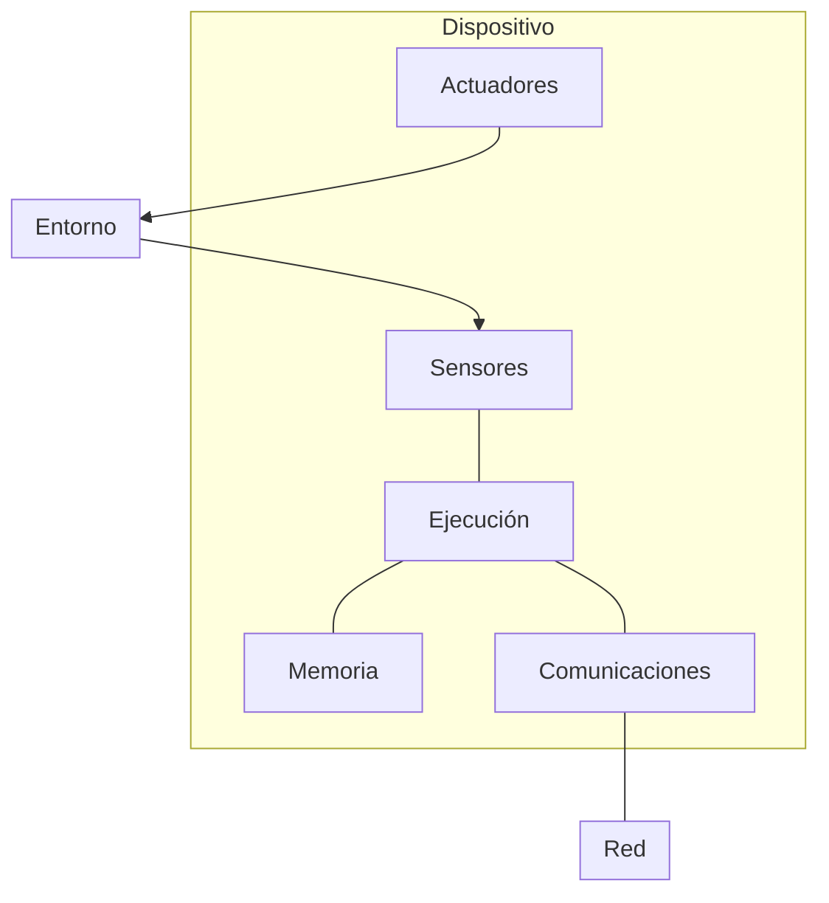

# 1. Introducción a SEU
2025-01-22 (YYYY-MM-DD) @ 17:19
Rodríguez López, Alejandro // UO281827

Tags:
	#showable
	Hecho en #EPI
	Sobre #SEU
	Para #Apuntes 
	Otros:
	Refs:
 

## Descripción

- Sistema diseñado para ejecutar tarea específica.
- Es una parte de un sistema mayor.
- Procesador optimizado para su tarea.
- A veces tienen restricciones de tiempo real (RTOS).
	- Que tienen que resolver una tarea en un tiempo determinado.
- Usuario puede no conocer su existencia.

## Componentes

- Microprocesador.
- Memoria.
- Temporizadores.
- I/O.
- Conversores A/D y D/A.
- HW para depuración.
	- El microcontrolador de un SeM no tiene los recursos para depurar, es necesario HW específico que derive la carga a un sistema externo (un PC).

## Retos

- Eficiencia:
	- Recursos limitados.
- Restricciones Temporales:
	- Tienen fecha de entrega.
	- _Soft Real Time_: Si la respuesta se proporciona después del _deadline_, sigue funcionando.
	- _Hard Real Time_: Si la respuesta se proporciona después del _deadline_, falla.
- Confiabilidad:
	- El sistema impacta al entorno.
	- Disponibilidad.
	- Fiabilidad.
	- Seguridad.
	- Integridad.
	- Mantenibilidad.

## Dispositivos Inteligentes

## Sistemas Ubicuos

- Antes: Un mainframe, N usuarios.
- Ahora: Un sistema (PC), un usuario.
- Ubicuos: Varios sistemas (PC, Tablet, SmartPhone, Wearable...), un usuario.
