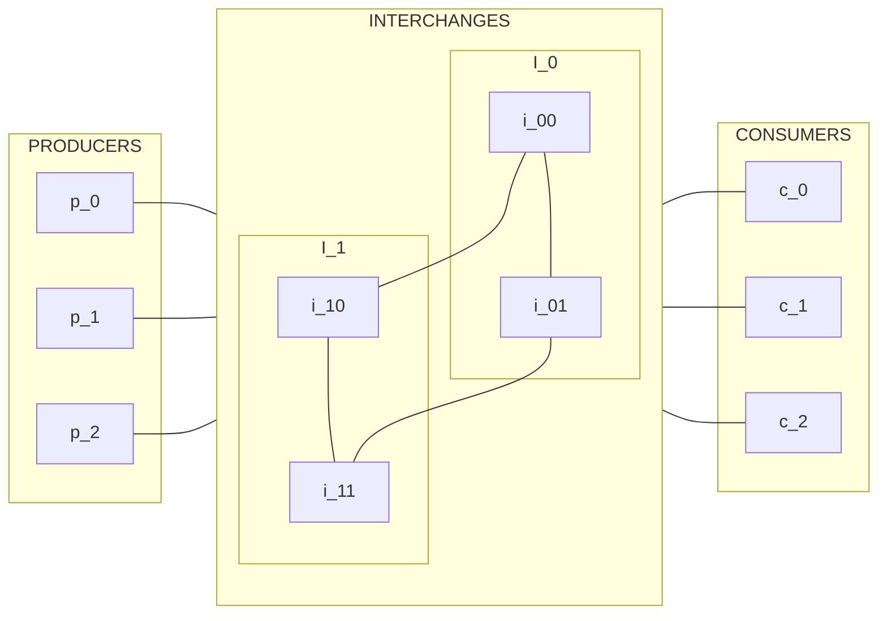

# Dynamic A*
2024-12-03 (YYYY-MM-DD) @ 17:38
Rodríguez López, Alejandro // UO281827

Tags:
	#showable
	Hecho en #EPI
	Sobre #Apuntes
	Para #TFM
	Otros:
	Refs:
 
<hr>

## The Algorithm

[The Greatest StackExchange Thread of All Time](https://cstheory.stackexchange.com/questions/11855/how-do-the-state-of-the-art-pathfinding-algorithms-for-changing-graphs-d-d-l)

### Recalculations

#### D*

- Recalculates path from current position to goal node.
- Much faster than A\*.

#### Focused D*

- More realtime than D\*.
- Not many comparisons.

#### LPA*

- First run is A\*.
- Keeps cost of vertices.
- When cost changes kept information on vertices costs is used.
- Does not use D\* but A\*.

#### D*-Lite

- LPA\*.
- Uses D\* instead of A\*.

### Moving Target

#### GAA*

- Variant of A\*.
- Only 2D graphs.

#### GFRA*

- Variant of GAA\*.
- Allows non-2D graphs.

#### MTD*-Lite

- Variant of D\*-Lite and GFRA\*.
- Moving target.
- Dynamic graph.

### Suboptimal

#### Anytime D*

- Variant of D\*-Lite.
- Runs under any time constraints.
- Quick suboptimal path that gets improved as time goes on.

#### HPA* and PRA*

- Routes large number of entities.
- May route each entity to a different target.

#### HAA*

- Restricted traversal (i.e. some entities may go only through some vertices).

### Summary

- D\*-Lite
- MTD\*-Lite
- Anytime D\*

## The Problem

### Power Routing

```python
class Producer:
	_output_rate: int

class Interchange:
	_capacity: int
	_load: int

class Consumer:
	_consumption_rate: int
	_load: int
```



![[Drawing 2024-12-02 17.42.00.excalidraw|1900]]
