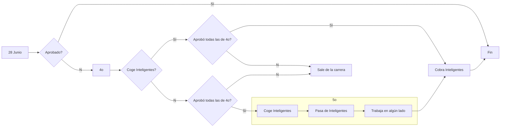

```mermaid
flowchart LR

	A[28 Junio] --> Q1{Aprobado?}
	Q1 --Sí--> B[Fin]
	Q1 --No--> C[4o]
		C --> Q2{Coge Inteligentes?}
			Q2 --Sí--> Q3{Aprobó todas las de 4o?}
				Q3 --Sí--> D[Cobra Inteligentes]
					D --> B
				Q3 --No--> G[Sale de la carrera]
			Q2 --No--> Q4{Aprobó todas las de 4o?}
				Q4 --No--> G
				Q4 --Sí--> F[Coge Inteligentes]
					subgraph E[5o]
						F --> H[Pasa de Inteligentes]
						H --> I[Trabaja en algún lado]
					end
					I --> D		
```
